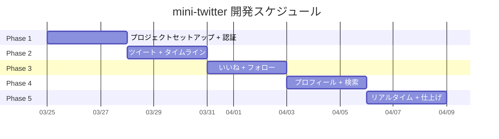
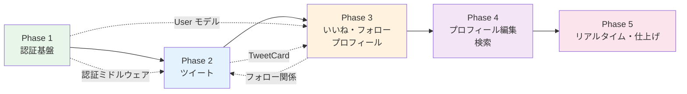
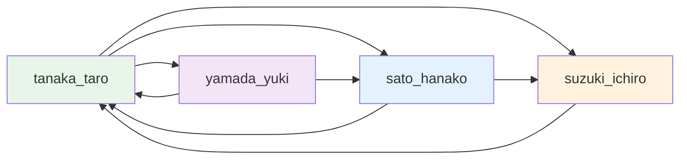

# mini-twitter 実装計画

## 目次

1. [開発フェーズ](#1-開発フェーズ)
2. [ディレクトリ構成](#2-ディレクトリ構成)
3. [開発環境セットアップ手順](#3-開発環境セットアップ手順)
4. [開発コマンド一覧](#4-開発コマンド一覧)
5. [シードデータ](#5-シードデータ)

---

## 1. 開発フェーズ

全5フェーズ、各フェーズ2〜3日（合計10〜15日）。
各フェーズ末に動作確認可能な成果物を定義し、前フェーズの完了を前提に次フェーズへ進む。



---

### Phase 1: プロジェクトセットアップ + 認証（2〜3日）

**ゴール**: ユーザーがサインアップ・ログイン・ログアウトでき、セッションがブラウザリロード後も維持される（HttpOnly Cookie）。

#### バックエンド

| #     | タスク                                       | 成果物                                                                                                                 | 対応要件 |
| ----- | -------------------------------------------- | ---------------------------------------------------------------------------------------------------------------------- | -------- |
| 1-B1  | Rails 8.0 APIモードプロジェクト作成          | `backend/` ディレクトリ一式                                                                                            | —        |
| 1-B2  | Docker Compose 作成（PostgreSQL 17 + Redis） | `backend/docker-compose.yml`                                                                                           | —        |
| 1-B3  | Gem 追加・初期設定                           | `graphql-ruby`, `jwt_sessions`, `rack-cors`, `rack-attack`, `rspec-rails`, `factory_bot_rails`                         | —        |
| 1-B4  | `users` テーブル migration + モデル          | `User` モデル + `HasUuid` concern。`tweets_count`, `followers_count`, `following_count` カウンターキャッシュカラム含む | —        |
| 1-B5  | `credentials` テーブル migration + モデル    | `Credential` モデル（`has_secure_password`）                                                                           | —        |
| 1-B6  | `HasUuid` concern 作成                       | `app/models/concerns/has_uuid.rb`                                                                                      | —        |
| 1-B7  | jwt_sessions 設定                            | `config/initializers/jwt_session.rb`（Redis接続、トークン有効期限、HttpOnly Cookie 設定）                              | —        |
| 1-B8  | GraphQLスキーマ基盤                          | `MiniTwitterSchema`, `BaseObject`, `BaseMutation`                                                                      | —        |
| 1-B9  | `UserType` 定義                              | GraphQL User型                                                                                                         | —        |
| 1-B10 | `AuthPayloadType` 定義                       | `accessToken` + `user`（`refreshToken` はCookieで送信、レスポンスボディに含まない）                                    | —        |
| 1-B11 | `TimelineScope` enum 定義                    | `FOLLOWING`, `GLOBAL`                                                                                                  | —        |
| 1-B12 | `signUp` mutation                            | ユーザー作成 + トークン発行 + Set-Cookie で refreshToken 送信                                                          | US-1     |
| 1-B13 | `signIn` mutation                            | 認証 + トークン発行 + Set-Cookie で refreshToken 送信                                                                  | US-2     |
| 1-B14 | `signOut` mutation                           | Redis からトークン削除 + Cookie 破棄（Max-Age=0）                                                                      | US-3     |
| 1-B15 | `refreshToken` mutation                      | 引数なし、Cookie から refreshToken 読み取り → Access Token 再発行                                                      | US-4     |
| 1-B16 | `me` query                                   | ログインユーザー情報取得                                                                                               | —        |
| 1-B17 | `GraphqlController` に認証ヘルパー追加       | `current_user` メソッド                                                                                                | —        |
| 1-B18 | rack-cors 設定                               | `config/initializers/cors.rb`（`credentials: true` 含む）                                                              | —        |
| 1-B19 | rack-attack 設定                             | `config/initializers/rack_attack.rb`（認証5回/分、投稿30回/分）                                                        | —        |
| 1-B20 | エラーハンドリング共通処理                   | top-level errors。エラーコード: `AUTHENTICATION_ERROR`, `AUTHORIZATION_ERROR`, `VALIDATION_ERROR`, `NOT_FOUND`         | —        |

#### フロントエンド

| #     | タスク                                            | 成果物                                                                                                                   | 対応要件 |
| ----- | ------------------------------------------------- | ------------------------------------------------------------------------------------------------------------------------ | -------- |
| 1-F1  | Vite + React 19 + TypeScript 5.9 プロジェクト作成 | `frontend/` ディレクトリ一式                                                                                             | —        |
| 1-F2  | 基本ライブラリ導入                                | TanStack Router, Apollo Client, Zustand, HeroUI v2, Tailwind CSS v4, React Hook Form, Zod, dayjs, Biome                  | —        |
| 1-F3  | Apollo Client セットアップ                        | `src/lib/apollo/client.ts`（auth header, error link, `credentials: 'include'`）                                          | —        |
| 1-F4  | graphql-codegen セットアップ                      | `codegen.ts` + 初回型生成                                                                                                | —        |
| 1-F5  | Zustand authStore                                 | `src/lib/stores/authStore.ts`（user, accessToken, isAuthenticated。refreshToken はCookieベースのためストアに保持しない） | —        |
| 1-F6  | Zustand uiStore                                   | `src/lib/stores/uiStore.ts`（isProfileEditOpen, activeTimelineTab, activeProfileTab, activeSearchTab, isTweetModalOpen） | —        |
| 1-F7  | ルーティング基盤                                  | TanStack Router file-based routing + `__root.tsx`                                                                        | —        |
| 1-F8  | `_auth.tsx` レイアウト                            | AuthGuard + 2カラムレイアウト（左サイドバー + メイン）                                                                   | —        |
| 1-F9  | `_guest.tsx` レイアウト                           | GuestGuard + センター配置                                                                                                | —        |
| 1-F10 | `Sidebar` コンポーネント                          | ロゴ、ナビリンク（ホーム/検索/プロフィール）、ツイートボタン、ログアウト。タブレットではアイコンのみ                     | —        |
| 1-F11 | `BottomNav` コンポーネント                        | モバイル用ボトムナビ（ホーム/検索/プロフィール）                                                                         | —        |
| 1-F12 | `TopBar` コンポーネント                           | モバイル用トップバー（ロゴ + ユーザーアバター）                                                                          | —        |
| 1-F13 | サインアップ画面                                  | `src/routes/_guest/signup.tsx`（React Hook Form + Zod）                                                                  | US-1     |
| 1-F14 | ログイン画面                                      | `src/routes/_guest/login.tsx`                                                                                            | US-2     |
| 1-F15 | ログアウト機能                                    | Sidebar のログアウトボタン                                                                                               | US-3     |
| 1-F16 | トークンリフレッシュ                              | Apollo Link での 401 → refreshToken mutation（Cookie自動送信）→ retry                                                    | US-4     |
| 1-F17 | `LoadingScreen` コンポーネント                    | トークンリフレッシュ中のスプラッシュスクリーン                                                                           | —        |

#### 動作確認チェックリスト

- [ ] `docker compose up -d` で PostgreSQL + Redis が起動する
- [ ] `rails s` で API サーバーが起動する
- [ ] GraphQL Playground（`/graphiql`）でmutationを実行できる
- [ ] サインアップ → ログイン → ログアウトがUIから実行できる
- [ ] ブラウザリロード後もログイン状態が維持される（HttpOnly Cookie）
- [ ] 未認証でタイムライン（`/`）にアクセスすると `/login` にリダイレクトされる
- [ ] 認証済みで `/login` にアクセスすると `/` にリダイレクトされる
- [ ] デスクトップで左サイドバー + メインの2カラムレイアウトが表示される
- [ ] モバイルでトップバー + ボトムナビが表示される

---

### Phase 2: ツイート + タイムライン（2〜3日）

**ゴール**: ユーザーがツイートを投稿し、タイムライン（フォロー中 / 全体）で閲覧・削除できる。

#### バックエンド

| #    | タスク                               | 成果物                                                                                                   | 対応要件   |
| ---- | ------------------------------------ | -------------------------------------------------------------------------------------------------------- | ---------- |
| 2-B1 | `tweets` テーブル migration + モデル | `Tweet` モデル（バリデーション: 1〜300文字、空白のみ不可）。`likes_count` カウンターキャッシュカラム含む | BR-4       |
| 2-B2 | `TweetType` 定義                     | GraphQL Tweet型（author, likesCount, isLikedByMe）                                                       | —          |
| 2-B3 | `createTweet` mutation               | ツイート投稿                                                                                             | US-5       |
| 2-B4 | `deleteTweet` mutation               | 投稿者本人のみ削除可                                                                                     | US-6, BR-9 |
| 2-B5 | `timeline` query                     | フォロー中ユーザーのツイート（Relay Connection）                                                         | US-8       |
| 2-B6 | `publicTimeline` query               | 全体タイムライン（Relay Connection）                                                                     | US-9       |
| 2-B7 | `userTweets` query                   | 指定ユーザーのツイート一覧                                                                               | US-21      |
| 2-B8 | Relay Connection 共通化              | `ConnectionHelper` モジュール（cursor生成、ページネーション処理）                                        | —          |
| 2-B9 | DataLoader 設定                      | N+1対策（Tweet → User）                                                                                  | —          |

#### フロントエンド

| #     | タスク                                     | 成果物                                                       | 対応要件    |
| ----- | ------------------------------------------ | ------------------------------------------------------------ | ----------- |
| 2-F1  | GraphQL operations 定義 + codegen          | `src/lib/graphql/operations/tweet.ts`                        | —           |
| 2-F2  | `TweetCard` コンポーネント                 | ツイート表示（アバター、ユーザー名、本文、相対時間）         | US-7        |
| 2-F3  | `TimeDisplay` コンポーネント               | dayjs 相対時間（5分前→24時間超で絶対時間）                   | —           |
| 2-F4  | ホーム/タイムライン画面                    | `src/routes/_auth/index.tsx`（タブ: フォロー中 / 全体）      | US-8, US-9  |
| 2-F5  | `TweetComposer` コンポーネント             | インライン投稿フォーム（タイムライン上部、デスクトップのみ） | US-5        |
| 2-F6  | `TweetComposerModal`                       | サイドバーのツイートボタンから開くモーダル投稿               | US-5        |
| 2-F7  | `InfiniteScrollList` + `useInfiniteScroll` | `IntersectionObserver` + `fetchMore`（Relay Connection）     | US-10       |
| 2-F8  | ツイート削除                               | `ConfirmDialog` → `cache.evict` + `cache.gc()`               | US-6, BR-12 |
| 2-F9  | `EmptyState` コンポーネント                | データ空時の表示                                             | —           |
| 2-F10 | ローディング・エラー状態                   | スケルトンUI + エラー表示                                    | —           |
| 2-F11 | `FAB` コンポーネント                       | モバイル用フローティングボタン → `/compose` 遷移             | —           |
| 2-F12 | ツイート投稿画面（モバイル専用）           | `src/routes/_auth/compose.tsx`                               | US-5        |

#### 動作確認チェックリスト

- [ ] 300文字以内のツイートを投稿できる（インライン + モーダル + モバイル）
- [ ] 300文字超、空白のみのツイートが拒否される
- [ ] タイムラインにツイートが新しい順で表示される
- [ ] フォロー中 / 全体タブが切り替えられる（Phase 3 完了後にフォロータイムラインは実データで確認）
- [ ] 20件以上ある場合、スクロールで追加読み込みされる
- [ ] 自分のツイートのみ削除ボタンが表示される
- [ ] 削除ダイアログで確認後、ツイートが消える
- [ ] サイドバーのツイートボタンでモーダル投稿ができる
- [ ] モバイルでFABタップ → `/compose` で投稿できる

---

### Phase 3: いいね + フォロー（2〜3日）

**ゴール**: いいね・フォロー/フォロワーの全ソーシャル機能が動作する。プロフィール・フォロー一覧画面が完成する。

#### バックエンド

| #     | タスク                                | 成果物                                                                                                                                             | 対応要件     |
| ----- | ------------------------------------- | -------------------------------------------------------------------------------------------------------------------------------------------------- | ------------ |
| 3-B1  | `likes` テーブル migration + モデル   | `Like` モデル（user_id + tweet_id UNIQUE）。`counter_cache: { tweet: :likes_count }`                                                               | BR-8         |
| 3-B2  | `follows` テーブル migration + モデル | `Follow` モデル（follower_id + followed_id UNIQUE、自己フォロー防止）。`counter_cache: { follower: :following_count, followed: :followers_count }` | BR-7         |
| 3-B3  | `likeTweet` mutation                  | いいね追加（重複チェック）                                                                                                                         | US-11        |
| 3-B4  | `unlikeTweet` mutation                | いいね取消                                                                                                                                         | US-12        |
| 3-B5  | `follow` mutation                     | フォロー（自己フォロー防止）                                                                                                                       | US-15        |
| 3-B6  | `unfollow` mutation                   | フォロー解除                                                                                                                                       | US-16        |
| 3-B7  | `likedTweets` query                   | 自分のいいね一覧（Relay Connection）                                                                                                               | US-14        |
| 3-B8  | `followers` query                     | フォロワー一覧（Relay Connection）                                                                                                                 | US-17        |
| 3-B9  | `following` query                     | フォロー中一覧（Relay Connection）                                                                                                                 | US-17        |
| 3-B10 | `UserType` にカウントフィールド追加   | `tweetsCount`, `followingCount`, `followersCount`, `isFollowedByMe`（counter_cache から取得）                                                      | US-13, US-18 |
| 3-B11 | DataLoader 追加                       | N+1対策（Like存在チェック、Follow存在チェック）                                                                                                    | —            |

#### フロントエンド

| #    | タスク                                               | 成果物                                                                                     | 対応要件            |
| ---- | ---------------------------------------------------- | ------------------------------------------------------------------------------------------ | ------------------- |
| 3-F1 | GraphQL operations 定義 + codegen                    | いいね・フォロー関連のoperation                                                            | —                   |
| 3-F2 | いいねボタン（`TweetCard` に追加）                   | ハートアイコン + カウント + 楽観的更新                                                     | US-11, US-12, US-13 |
| 3-F3 | `FollowButton` コンポーネント                        | フォロー/フォロー中ボタン + 楽観的更新                                                     | US-15, US-16        |
| 3-F4 | `UserCard` コンポーネント                            | ユーザー一覧表示用（アバター、名前、bio、フォローボタン）                                  | —                   |
| 3-F5 | プロフィール画面 `/:username`                        | `src/routes/_auth/users/$username.tsx`（タブ: 投稿 / いいね。いいねタブは自分のみ）        | US-19, US-21, US-14 |
| 3-F6 | フォロー/フォロワー一覧画面 `/:username/connections` | `src/routes/_auth/users/$username.connections.tsx`（`?tab=followers\|following` タブ切替） | US-17, US-18        |
| 3-F7 | Apollo cache 楽観的更新                              | `likeTweet` / `unlikeTweet` / `follow` / `unfollow` のキャッシュ更新ロジック               | —                   |

#### 動作確認チェックリスト

- [ ] ツイートにいいねできる（ハートが赤くなり、カウントが増加）
- [ ] いいねを取り消せる（ハートが元に戻り、カウントが減少）
- [ ] 自分のプロフィールの「いいね」タブにいいねしたツイートが表示される
- [ ] 他人のプロフィールに「いいね」タブが表示されない
- [ ] 他ユーザーをフォローできる
- [ ] フォローを解除できる
- [ ] 自分自身のフォローボタンは表示されない
- [ ] `/:username/connections?tab=followers` でフォロワー一覧が表示される
- [ ] `/:username/connections?tab=following` でフォロー中一覧が表示される
- [ ] フォロータイムラインにフォロー中ユーザーのツイートのみ表示される
- [ ] いいね・フォローの反映がUI上即座（楽観的更新）

---

### Phase 4: プロフィール編集 + 検索（2〜3日）

**ゴール**: プロフィール編集・アバターアップロード、ユーザー/ツイート検索が動作する。

#### バックエンド

| #    | タスク                            | 成果物                                                         | 対応要件     |
| ---- | --------------------------------- | -------------------------------------------------------------- | ------------ |
| 4-B1 | `userByUsername` query            | username指定でユーザー情報取得                                 | US-19        |
| 4-B2 | `updateProfile` mutation          | 表示名・自己紹介の更新（本人のみ）                             | US-20, BR-10 |
| 4-B3 | Active Storage セットアップ       | `rails active_storage:install` + ローカルストレージ設定        | —            |
| 4-B4 | `updateAvatar` mutation           | graphql-multipart対応、バリデーション（2MB, JPEG/PNG/WebP）    | US-20, BR-11 |
| 4-B5 | `avatarUrl` フィールド実装        | `UserType` に `avatar_url` resolver追加                        | —            |
| 4-B6 | pg_trgm 有効化 + インデックス追加 | `enable_extension "pg_trgm"` + GINインデックス                 | —            |
| 4-B7 | `searchUsers` query               | `username` / `display_name` の部分一致検索（Relay Connection） | US-22        |
| 4-B8 | `searchTweets` query              | `content` の部分一致検索（Relay Connection）                   | US-23        |

#### フロントエンド

| #    | タスク                            | 成果物                                                                         | 対応要件     |
| ---- | --------------------------------- | ------------------------------------------------------------------------------ | ------------ |
| 4-F1 | GraphQL operations 定義 + codegen | プロフィール・検索関連のoperation                                              | —            |
| 4-F2 | `ProfileHeader` コンポーネント    | アバター、表示名、@username、bio、フォロー数/フォロワー数、編集/フォローボタン | —            |
| 4-F3 | プロフィール編集モーダル          | React Hook Form + Zod（displayName, bio）+ HeroUI Modal                        | US-20        |
| 4-F4 | `AvatarUploader` コンポーネント   | `input type="file"` + graphql-multipart + プレビュー                           | US-20        |
| 4-F5 | 検索画面 `/search`                | `src/routes/_auth/search.tsx`（タブ: ユーザー / ツイート）                     | US-22, US-23 |
| 4-F6 | `SearchInput` コンポーネント      | デバウンス 300ms、3文字以上で検索実行、クリアボタン                            | US-24        |
| 4-F7 | 検索結果の無限スクロール          | Relay Connection ページネーション                                              | US-24        |

#### 動作確認チェックリスト

- [ ] `/:username` でプロフィールページが表示される（`userByUsername` 使用）
- [ ] 自分のプロフィールに「編集」ボタン、他人には「フォロー」ボタンが表示される
- [ ] 表示名・自己紹介を編集して保存できる
- [ ] アバター画像をアップロードし、プロフィール・ツイートカードに反映される
- [ ] 2MB超の画像がエラーになる
- [ ] ユーザー名でユーザーを検索できる（3文字以上）
- [ ] キーワードでツイートを検索できる
- [ ] 検索結果がページネーションされる

---

### Phase 5: リアルタイム + 仕上げ（2〜3日）

**ゴール**: リアルタイム通知、テスト、レスポンシブ仕上げが揃い、MVP完成。

#### バックエンド

| #    | タスク                          | 成果物                                                                                              | 対応要件 |
| ---- | ------------------------------- | --------------------------------------------------------------------------------------------------- | -------- |
| 5-B1 | ActionCable / SSE 設定          | GraphQL Subscription の transport 設定                                                              | —        |
| 5-B2 | `tweetAdded` subscription       | `scope: TimelineScope!` 引数付き。`FOLLOWING`: フォロー中ユーザーのみ配信、`GLOBAL`: 全ユーザー配信 | US-25    |
| 5-B3 | `tweetLikeUpdated` subscription | いいね数リアルタイム更新                                                                            | US-26    |
| 5-B4 | RSpec: モデルテスト             | User, Credential, Tweet, Like, Follow の全バリデーション・リレーション                              | —        |
| 5-B5 | RSpec: GraphQL mutation テスト  | 全12 mutation の正常系・異常系                                                                      | —        |
| 5-B6 | RSpec: GraphQL query テスト     | 全10 query の正常系（認証あり/なし）                                                                | —        |
| 5-B7 | シードデータ作成                | `db/seeds.rb`                                                                                       | —        |

#### フロントエンド

| #    | タスク                         | 成果物                                                                          | 対応要件 |
| ---- | ------------------------------ | ------------------------------------------------------------------------------- | -------- |
| 5-F1 | Subscription クライアント設定  | Apollo Client SSE link 設定                                                     | —        |
| 5-F2 | 新着ツイートバナー             | 「N件の新しいツイート」→ クリックで読み込み。スコープ別: `FOLLOWING` / `GLOBAL` | US-25    |
| 5-F3 | いいね数リアルタイム反映       | `tweetLikeUpdated` のキャッシュ更新                                             | US-26    |
| 5-F4 | レスポンシブ仕上げ             | 3ブレークポイント対応（〜640px / 641〜1024px / 1025px〜）                       | —        |
| 5-F5 | `ErrorBoundary` コンポーネント | エラー境界（リトライボタン付き）                                                | —        |
| 5-F6 | Vitest: コンポーネントテスト   | TweetCard, FollowButton, 認証フォーム                                           | —        |
| 5-F7 | Vitest: フックテスト           | useInfiniteScroll, authStore                                                    | —        |

#### 動作確認チェックリスト

- [ ] 別タブで投稿すると、フォロー中タブにフォロー中ユーザーのツイートのみバナー表示される
- [ ] 全体タブでは全ユーザーのツイートがバナー表示される
- [ ] バナーをクリックすると新しいツイートが読み込まれる
- [ ] 別タブでいいねすると、リアルタイムでカウントが更新される
- [ ] モバイル（〜640px）でボトムナビ + FABが表示される
- [ ] タブレット（641〜1024px）でアイコンのみサイドバーが表示される
- [ ] デスクトップ（1025px〜）で2カラムレイアウトが表示される
- [ ] `rspec` が全テスト通過する（カバレッジ80%以上）
- [ ] `pnpm test` がフロントエンドテスト通過する

---

### フェーズ間の依存関係



> **補足**: Phase 2 のフォロータイムライン（`timeline` query）はフォロー関係に依存するが、Phase 2 時点では空の結果を返す。Phase 3 でフォロー機能実装後に実データで確認する。

---

## 2. ディレクトリ構成

```
apps/mini-twitter/
├── backend/                          # Rails 8.0 API
│   ├── app/
│   │   ├── controllers/
│   │   │   ├── application_controller.rb
│   │   │   └── graphql_controller.rb      # GraphQL 単一エンドポイント
│   │   ├── graphql/
│   │   │   ├── mini_twitter_schema.rb     # スキーマ定義（query/mutation/subscription root）
│   │   │   ├── types/
│   │   │   │   ├── base_object.rb
│   │   │   │   ├── base_argument.rb
│   │   │   │   ├── base_field.rb
│   │   │   │   ├── base_enum.rb
│   │   │   │   ├── base_input_object.rb
│   │   │   │   ├── base_union.rb
│   │   │   │   ├── base_connection.rb
│   │   │   │   ├── base_edge.rb
│   │   │   │   ├── node_type.rb
│   │   │   │   ├── query_type.rb          # 全 Query のエントリポイント
│   │   │   │   ├── mutation_type.rb       # 全 Mutation のエントリポイント
│   │   │   │   ├── subscription_type.rb   # 全 Subscription のエントリポイント
│   │   │   │   ├── user_type.rb           # User 型
│   │   │   │   ├── tweet_type.rb          # Tweet 型
│   │   │   │   ├── auth_payload_type.rb   # AuthPayload 型（accessToken + user）
│   │   │   │   ├── date_time_type.rb      # DateTime カスタムスカラー
│   │   │   │   ├── timeline_scope_type.rb # TimelineScope enum（FOLLOWING, GLOBAL）
│   │   │   │   ├── tweet_connection_type.rb
│   │   │   │   └── user_connection_type.rb
│   │   │   ├── mutations/
│   │   │   │   ├── base_mutation.rb
│   │   │   │   ├── sign_up.rb
│   │   │   │   ├── sign_in.rb
│   │   │   │   ├── sign_out.rb
│   │   │   │   ├── refresh_token.rb
│   │   │   │   ├── create_tweet.rb
│   │   │   │   ├── delete_tweet.rb
│   │   │   │   ├── like_tweet.rb
│   │   │   │   ├── unlike_tweet.rb
│   │   │   │   ├── follow.rb
│   │   │   │   ├── unfollow.rb
│   │   │   │   ├── update_profile.rb
│   │   │   │   └── update_avatar.rb
│   │   │   ├── subscriptions/
│   │   │   │   ├── tweet_added.rb
│   │   │   │   └── tweet_like_updated.rb
│   │   │   └── sources/                   # graphql-ruby DataLoader sources
│   │   │       ├── record_loader.rb       # 汎用 ActiveRecord ローダー
│   │   │       ├── count_loader.rb        # カウント集約ローダー
│   │   │       └── association_loader.rb  # アソシエーションローダー
│   │   ├── models/
│   │   │   ├── application_record.rb
│   │   │   ├── concerns/
│   │   │   │   └── has_uuid.rb            # UUID 自動生成 concern
│   │   │   ├── user.rb                    # has_one :credential, has_many :tweets/likes/follows
│   │   │   ├── credential.rb             # belongs_to :user, has_secure_password
│   │   │   ├── tweet.rb                  # belongs_to :user, has_many :likes
│   │   │   ├── like.rb                   # belongs_to :user, belongs_to :tweet
│   │   │   └── follow.rb                 # belongs_to :follower/:followed (User)
│   │   └── services/                      # ビジネスロジック（必要に応じて）
│   │       └── auth_service.rb            # トークン生成・検証の共通処理
│   ├── config/
│   │   ├── database.yml                   # PostgreSQL 接続設定
│   │   ├── routes.rb                      # POST /graphql のみ
│   │   ├── storage.yml                    # Active Storage ローカル設定
│   │   ├── cable.yml                      # ActionCable（Subscription用）
│   │   └── initializers/
│   │       ├── cors.rb                    # rack-cors 設定（credentials: true）
│   │       ├── rack_attack.rb             # レート制限設定
│   │       └── jwt_session.rb             # jwt_sessions 設定（Redis URL、有効期限、HttpOnly Cookie）
│   ├── db/
│   │   ├── migrate/
│   │   │   ├── XXXXXX_enable_pgcrypto.rb          # uuid 生成用 extension
│   │   │   ├── XXXXXX_create_users.rb             # tweets_count, followers_count, following_count 含む
│   │   │   ├── XXXXXX_create_credentials.rb
│   │   │   ├── XXXXXX_create_tweets.rb            # likes_count 含む
│   │   │   ├── XXXXXX_create_likes.rb
│   │   │   ├── XXXXXX_create_follows.rb
│   │   │   ├── XXXXXX_enable_pg_trgm.rb           # pg_trgm 拡張
│   │   │   └── XXXXXX_add_trgm_indexes.rb         # GIN インデックス追加
│   │   ├── schema.rb
│   │   └── seeds.rb                       # 開発用シードデータ
│   ├── spec/
│   │   ├── rails_helper.rb
│   │   ├── spec_helper.rb
│   │   ├── factories/
│   │   │   ├── users.rb
│   │   │   ├── credentials.rb
│   │   │   ├── tweets.rb
│   │   │   ├── likes.rb
│   │   │   └── follows.rb
│   │   ├── models/
│   │   │   ├── user_spec.rb
│   │   │   ├── credential_spec.rb
│   │   │   ├── tweet_spec.rb
│   │   │   ├── like_spec.rb
│   │   │   └── follow_spec.rb
│   │   └── graphql/
│   │       ├── mutations/
│   │       │   ├── sign_up_spec.rb
│   │       │   ├── sign_in_spec.rb
│   │       │   ├── create_tweet_spec.rb
│   │       │   └── ...
│   │       └── queries/
│   │           ├── timeline_spec.rb
│   │           ├── me_spec.rb
│   │           └── ...
│   ├── Gemfile
│   ├── Gemfile.lock
│   ├── Procfile.dev                       # foreman 用（rails s + その他）
│   ├── docker-compose.yml                 # PostgreSQL 17 + Redis
│   └── .env.development                   # 環境変数（DB接続、Redis URL）
│
├── frontend/                              # React 19 + TypeScript + Vite
│   ├── src/
│   │   ├── main.tsx                       # エントリポイント（Apollo + Router + HeroUI Provider）
│   │   ├── app.css                        # Tailwind CSS v4 エントリ（@import "tailwindcss"）
│   │   ├── routes/
│   │   │   ├── __root.tsx                 # TanStack Router root route（AppLayout）
│   │   │   ├── _auth.tsx                  # 認証必須レイアウト（AuthGuard + 2カラム）
│   │   │   ├── _guest.tsx                 # 未認証専用レイアウト（GuestGuard + センター配置）
│   │   │   ├── _auth/
│   │   │   │   ├── index.tsx              # ホーム/タイムライン
│   │   │   │   ├── compose.tsx            # ツイート投稿（モバイル用）
│   │   │   │   ├── search.tsx             # 検索画面
│   │   │   │   └── users/
│   │   │   │       ├── $username.tsx              # /:username — プロフィール（タブ: 投稿/いいね）
│   │   │   │       └── $username.connections.tsx  # /:username/connections — フォロー/フォロワー
│   │   │   ├── _guest/
│   │   │   │   ├── login.tsx              # ログイン画面
│   │   │   │   └── signup.tsx             # サインアップ画面
│   │   ├── components/
│   │   │   ├── layout/
│   │   │   │   ├── AppLayout.tsx          # 2カラムレイアウト（左サイドバー + メイン）
│   │   │   │   ├── Sidebar.tsx            # 左サイドバー（デスクトップ・タブレット）
│   │   │   │   ├── BottomNav.tsx          # ボトムナビ（モバイル）
│   │   │   │   ├── TopBar.tsx             # トップバー（モバイル）
│   │   │   │   └── FAB.tsx               # フローティングボタン（モバイル）
│   │   │   ├── tweet/
│   │   │   │   ├── TweetCard.tsx          # ツイート表示カード
│   │   │   │   ├── TweetList.tsx          # ツイート一覧（無限スクロール）
│   │   │   │   ├── TweetComposer.tsx      # インライン投稿フォーム
│   │   │   │   ├── TweetComposerModal.tsx # モーダル投稿フォーム
│   │   │   │   └── DeleteTweetDialog.tsx  # 削除確認ダイアログ
│   │   │   ├── user/
│   │   │   │   ├── UserCard.tsx           # ユーザー一覧表示カード
│   │   │   │   ├── UserList.tsx           # ユーザー一覧
│   │   │   │   ├── FollowButton.tsx       # フォロー/フォロー解除ボタン
│   │   │   │   ├── ProfileHeader.tsx      # プロフィール上部（アバター、名前、bio、カウント）
│   │   │   │   ├── ProfileEditModal.tsx   # プロフィール編集モーダル
│   │   │   │   └── AvatarUploader.tsx     # アバター画像アップロード
│   │   │   ├── search/
│   │   │   │   └── SearchInput.tsx        # デバウンス付き検索入力
│   │   │   └── common/
│   │   │       ├── InfiniteScroll.tsx     # 無限スクロールラッパー
│   │   │       ├── EmptyState.tsx         # 空状態表示
│   │   │       ├── LoadingSpinner.tsx     # ローディング
│   │   │       ├── LoadingScreen.tsx      # 全画面ローディング（トークンリフレッシュ中）
│   │   │       ├── ErrorMessage.tsx       # エラー表示
│   │   │       ├── ErrorBoundary.tsx      # エラー境界
│   │   │       ├── ConfirmDialog.tsx      # 確認ダイアログ
│   │   │       └── TimeDisplay.tsx        # dayjs 相対時間表示
│   │   ├── hooks/
│   │   │   ├── useInfiniteScroll.ts       # Intersection Observer ベースの無限スクロール
│   │   │   ├── useDebounce.ts             # デバウンスフック
│   │   │   └── useAuth.ts                # 認証状態へのショートカット
│   │   ├── lib/
│   │   │   ├── apollo/
│   │   │   │   ├── client.ts              # Apollo Client インスタンス生成
│   │   │   │   ├── authLink.ts            # Authorization ヘッダー付与
│   │   │   │   ├── errorLink.ts           # 401 → refresh → retry
│   │   │   │   └── sseLink.ts             # SSE transport（Subscription 用）
│   │   │   ├── graphql/
│   │   │   │   ├── operations/
│   │   │   │   │   ├── auth.ts            # signUp, signIn, signOut, refreshToken, me
│   │   │   │   │   ├── tweet.ts           # createTweet, deleteTweet, timeline, etc.
│   │   │   │   │   ├── like.ts            # likeTweet, unlikeTweet, likedTweets
│   │   │   │   │   ├── follow.ts          # follow, unfollow, followers, following
│   │   │   │   │   ├── user.ts            # userByUsername, updateProfile, updateAvatar
│   │   │   │   │   ├── search.ts          # searchUsers, searchTweets
│   │   │   │   │   └── subscription.ts    # tweetAdded, tweetLikeUpdated
│   │   │   │   └── generated/             # graphql-codegen 自動生成
│   │   │   │       ├── graphql.ts         # 型定義
│   │   │   │       └── gql.ts             # typed document nodes
│   │   │   ├── stores/
│   │   │   │   ├── authStore.ts           # 認証状態（user, accessToken, isAuthenticated）
│   │   │   │   └── uiStore.ts             # UI状態（モーダル、タブ切替等）
│   │   │   └── validations/
│   │   │       ├── authSchema.ts          # サインアップ/ログインの Zod スキーマ
│   │   │       ├── tweetSchema.ts         # ツイート投稿の Zod スキーマ
│   │   │       └── profileSchema.ts       # プロフィール編集の Zod スキーマ
│   │   └── types/
│   │       └── index.ts                   # 共通型定義
│   ├── public/
│   ├── index.html
│   ├── package.json
│   ├── pnpm-lock.yaml
│   ├── tsconfig.json
│   ├── tsconfig.app.json
│   ├── tsconfig.node.json
│   ├── vite.config.ts                     # Vite 設定（proxy: /graphql → Rails）
│   ├── biome.json                         # Biome 設定（lint + format）
│   ├── codegen.ts                         # graphql-codegen 設定
│   └── tailwind.config.ts                 # Tailwind CSS v4（HeroUI plugin）
│
├── docs/
│   ├── requirements.md                    # 要件定義
│   ├── tech-stack.md                      # 技術スタック
│   ├── tech-stack-decisions.md            # 技術選定理由
│   ├── data-model.md                      # データモデル定義
│   ├── api-spec.md                        # GraphQL API 仕様
│   ├── screen-spec.md                     # 画面仕様
│   └── implementation-plan.md             # 本ドキュメント
└── README.md                              # プロジェクト概要 + セットアップ手順
```

### 主要ファイルの役割

#### バックエンド

| ファイル / ディレクトリ       | 役割                                                                                                                |
| ----------------------------- | ------------------------------------------------------------------------------------------------------------------- |
| `graphql_controller.rb`       | 唯一のコントローラ。`POST /graphql` を受けて `MiniTwitterSchema.execute` を呼び出す。`current_user` をcontextに渡す |
| `mini_twitter_schema.rb`      | GraphQLスキーマのルート。Query / Mutation / Subscription の root type を定義                                        |
| `types/`                      | GraphQL型定義。Relay Connection型もここに配置                                                                       |
| `mutations/`                  | 各 Mutation の実装。引数バリデーション → ビジネスロジック → レスポンス                                              |
| `subscriptions/`              | Subscription の trigger / subscribe 定義                                                                            |
| `sources/`                    | graphql-ruby の DataLoader source。N+1 対策のバッチローダー                                                         |
| `models/concerns/has_uuid.rb` | 全モデルで `include HasUuid` して UUID を自動生成する共通concern                                                    |
| `services/auth_service.rb`    | jwt_sessions のトークン生成・検証をラップ。mutation から呼び出す                                                    |
| `docker-compose.yml`          | PostgreSQL 17 + Redis のコンテナ定義                                                                                |
| `.env.development`            | `DATABASE_URL`, `REDIS_URL` 等のローカル開発用環境変数                                                              |

#### フロントエンド

| ファイル / ディレクトリ   | 役割                                                                                                           |
| ------------------------- | -------------------------------------------------------------------------------------------------------------- |
| `main.tsx`                | アプリのエントリポイント。`ApolloProvider` + `RouterProvider` + `HeroUIProvider` をネスト                      |
| `routes/`                 | TanStack Router のファイルベースルーティング。`_auth` 配下は認証必須、`_guest` 配下は未認証専用                |
| `components/`             | 再利用可能なUIコンポーネント。ドメイン別（tweet, user, search）に分類                                          |
| `hooks/`                  | カスタムフック。ビュー非依存のロジックを切り出す                                                               |
| `lib/apollo/`             | Apollo Client の設定。auth link → error link → http link のチェーン構成。`credentials: 'include'` でCookie送信 |
| `lib/graphql/operations/` | GraphQL のクエリ・ミューテーション定義（`.ts` で `gql` タグ）                                                  |
| `lib/graphql/generated/`  | `graphql-codegen` の自動生成ファイル。手動編集禁止                                                             |
| `lib/stores/`             | Zustand ストア。認証状態（Cookie ベース）とUI状態を管理                                                        |
| `lib/validations/`        | Zod スキーマ定義。React Hook Form の `zodResolver` で使用                                                      |
| `codegen.ts`              | graphql-codegen の設定。Rails の schema dump or introspection をソースに型生成                                 |
| `vite.config.ts`          | 開発時の proxy 設定（`/graphql` → `http://localhost:3000`）                                                    |

---

## 3. 開発環境セットアップ手順

### 前提条件

| ツール         | バージョン       | インストール方法                                                  |
| -------------- | ---------------- | ----------------------------------------------------------------- |
| Ruby           | 3.3.x            | `rbenv install 3.3.7`                                             |
| Bundler        | 2.x              | `gem install bundler`                                             |
| Node.js        | 22.x LTS         | `nodenv install 22.14.0` or `nvm install 22`                      |
| pnpm           | 10.x             | `corepack enable && corepack prepare pnpm@latest --activate`      |
| Docker         | 27.x             | [Docker Desktop](https://www.docker.com/products/docker-desktop/) |
| Docker Compose | v2 (Docker 同梱) | Docker Desktop に含まれる                                         |

### セットアップ手順

#### Step 1: リポジトリに移動

```bash
cd ~/mywork/apps/mini-twitter
```

#### Step 2: Docker コンテナ起動（PostgreSQL + Redis）

```bash
cd backend
docker compose up -d
```

起動確認:

```bash
docker compose ps
# postgres  ... Up  0.0.0.0:5432->5432/tcp
# redis     ... Up  0.0.0.0:6379->6379/tcp
```

#### Step 3: バックエンドセットアップ

```bash
cd backend

# Gem インストール
bundle install

# データベース作成 + マイグレーション
bin/rails db:create
bin/rails db:migrate

# シードデータ投入
bin/rails db:seed

# 動作確認
bin/rails s
# => http://localhost:3000
```

#### Step 4: フロントエンドセットアップ

```bash
cd frontend

# 依存パッケージインストール
pnpm install

# GraphQL 型生成（Rails サーバーが起動している必要あり）
pnpm codegen

# 開発サーバー起動
pnpm dev
# => http://localhost:5173
```

#### Step 5: 動作確認

| 確認項目           | URL                                                                      |
| ------------------ | ------------------------------------------------------------------------ |
| フロントエンド     | http://localhost:5173                                                    |
| Rails API          | http://localhost:3000                                                    |
| GraphQL Playground | http://localhost:3000/graphiql                                           |
| PostgreSQL         | `localhost:5432`（user: `mini_twitter`, db: `mini_twitter_development`） |
| Redis              | `localhost:6379`                                                         |

#### Step 6: テスト実行

```bash
# バックエンドテスト
cd backend
bundle exec rspec

# フロントエンドテスト
cd frontend
pnpm test
```

### トラブルシューティング

| 症状                        | 原因                          | 対処                                                                                |
| --------------------------- | ----------------------------- | ----------------------------------------------------------------------------------- |
| `PG::ConnectionBad`         | PostgreSQL コンテナ未起動     | `docker compose up -d`                                                              |
| `Redis::CannotConnectError` | Redis コンテナ未起動          | `docker compose up -d`                                                              |
| `graphql-codegen` 失敗      | Rails サーバー未起動          | `bin/rails s` してから再実行                                                        |
| `CORS error`                | cors.rb 設定漏れ              | `config/initializers/cors.rb` にフロントエンドオリジンと `credentials: true` を追加 |
| `401 Unauthorized` ループ   | Refresh Token Cookie 期限切れ | ブラウザの Cookie をクリアして再ログイン                                            |

---

## 4. 開発コマンド一覧

### Docker

```bash
# コンテナ起動（バックグラウンド）
docker compose up -d

# コンテナ停止
docker compose down

# コンテナ停止 + データ削除（DBリセット時）
docker compose down -v

# ログ確認
docker compose logs -f postgres
docker compose logs -f redis

# PostgreSQL に直接接続
docker compose exec postgres psql -U mini_twitter -d mini_twitter_development
```

### バックエンド（Rails）

```bash
# サーバー起動（デフォルト: http://localhost:3000）
bin/rails s

# コンソール（IRB で ActiveRecord 操作）
bin/rails console

# マイグレーション
bin/rails db:migrate              # 実行
bin/rails db:migrate:status       # 状態確認
bin/rails db:rollback             # 1つ戻す
bin/rails db:rollback STEP=3      # 3つ戻す

# データベース
bin/rails db:create               # DB作成
bin/rails db:drop                 # DB削除
bin/rails db:reset                # drop + create + migrate + seed
bin/rails db:seed                 # シードデータ投入

# ジェネレータ
bin/rails g model ModelName field:type       # モデル生成
bin/rails g migration AddColumnToTable       # マイグレーション生成

# GraphQL
bin/rails g graphql:object User              # GraphQL 型生成
bin/rails g graphql:mutation CreateTweet      # Mutation 生成

# テスト
bundle exec rspec                            # 全テスト
bundle exec rspec spec/models/               # モデルテストのみ
bundle exec rspec spec/graphql/              # GraphQL テストのみ
bundle exec rspec spec/models/user_spec.rb   # ファイル指定
bundle exec rspec spec/models/user_spec.rb:15  # 行指定

# ルーティング確認
bin/rails routes
```

### フロントエンド（React + Vite）

```bash
# 開発サーバー起動（http://localhost:5173）
pnpm dev

# ビルド（dist/ に出力）
pnpm build

# ビルドプレビュー
pnpm preview

# テスト
pnpm test                        # Vitest 実行
pnpm test:watch                  # ウォッチモード
pnpm test:coverage               # カバレッジ付き

# Lint + Format（Biome）
pnpm lint                        # lint チェック
pnpm lint:fix                    # lint 自動修正
pnpm format                      # フォーマットチェック
pnpm format:fix                  # フォーマット自動修正
pnpm check                       # lint + format 一括チェック

# GraphQL Codegen
pnpm codegen                     # 型生成（1回実行）
pnpm codegen:watch               # ウォッチモード（開発中推奨）

# 型チェック
pnpm typecheck                   # tsc --noEmit
```

### 一括起動（Procfile.dev）

`backend/Procfile.dev` を作成して `foreman` で一括起動可能:

```procfile
# backend/Procfile.dev
rails: bin/rails s -p 3000
vite: cd ../frontend && pnpm dev
```

```bash
# foreman インストール（初回のみ）
gem install foreman

# 一括起動
cd backend
foreman start -f Procfile.dev
```

> **補足**: Docker コンテナ（PostgreSQL + Redis）は別途 `docker compose up -d` で起動しておく必要がある。

---

## 5. シードデータ

### 概要

開発時にすべての機能を即座にテストできるよう、以下のデータを `db/seeds.rb` で投入する。

| データ種別   | 件数 | 目的                                       |
| ------------ | ---- | ------------------------------------------ |
| ユーザー     | 5名  | プロフィール表示、検索テスト               |
| ツイート     | 25件 | タイムライン表示、無限スクロールテスト     |
| フォロー関係 | 8件  | フォロータイムライン、フォロワー一覧テスト |
| いいね       | 15件 | いいねカウント、いいね一覧テスト           |

### ユーザー一覧

| #   | username        | display_name | email                 | password      | bio                                                               |
| --- | --------------- | ------------ | --------------------- | ------------- | ----------------------------------------------------------------- |
| 1   | `tanaka_taro`   | 田中太郎     | tanaka@example.com    | `password123` | フルスタックエンジニア。Ruby と TypeScript が好き。               |
| 2   | `sato_hanako`   | 佐藤花子     | sato@example.com      | `password123` | デザイナー兼フロントエンドエンジニア。UI/UXに情熱を注いでいます。 |
| 3   | `suzuki_ichiro` | 鈴木一郎     | suzuki@example.com    | `password123` | バックエンドエンジニア。Rails歴5年。                              |
| 4   | `yamada_yuki`   | 山田ゆき     | yamada@example.com    | `password123` | 新卒エンジニア。日々学習中！                                      |
| 5   | `takahashi_ken` | 高橋健       | takahashi@example.com | `password123` | プロダクトマネージャー。技術も好き。                              |

> **ログイン用**: どのユーザーでも `password123` でログイン可能。

### フォロー関係



| フォローする人 | フォローされる人 |
| -------------- | ---------------- |
| tanaka_taro    | sato_hanako      |
| tanaka_taro    | suzuki_ichiro    |
| tanaka_taro    | yamada_yuki      |
| sato_hanako    | tanaka_taro      |
| sato_hanako    | suzuki_ichiro    |
| suzuki_ichiro  | tanaka_taro      |
| yamada_yuki    | tanaka_taro      |
| yamada_yuki    | sato_hanako      |

> **結果**: tanaka_taro は3人フォロー中、3人にフォローされている。takahashi_ken は誰もフォローしていない（フォロータイムラインが空の状態をテスト可能）。

### ツイートデータ（25件）

各ユーザーが 5件 ずつ投稿。タイムスタンプは過去数時間〜数日に分散させ、相対時間表示（「3時間前」「2日前」等）のテストに使う。

```ruby
# db/seeds.rb の概要

puts "=== Seeding mini-twitter development data ==="

# ユーザー + 認証情報
users_data = [
  {
    username: "tanaka_taro",
    display_name: "田中太郎",
    email: "tanaka@example.com",
    password: "password123",
    bio: "フルスタックエンジニア。Ruby と TypeScript が好き。"
  },
  {
    username: "sato_hanako",
    display_name: "佐藤花子",
    email: "sato@example.com",
    password: "password123",
    bio: "デザイナー兼フロントエンドエンジニア。UI/UXに情熱を注いでいます。"
  },
  {
    username: "suzuki_ichiro",
    display_name: "鈴木一郎",
    email: "suzuki@example.com",
    password: "password123",
    bio: "バックエンドエンジニア。Rails歴5年。"
  },
  {
    username: "yamada_yuki",
    display_name: "山田ゆき",
    email: "yamada@example.com",
    password: "password123",
    bio: "新卒エンジニア。日々学習中！"
  },
  {
    username: "takahashi_ken",
    display_name: "高橋健",
    email: "takahashi@example.com",
    password: "password123",
    bio: "プロダクトマネージャー。技術も好き。"
  }
]

users = users_data.map do |data|
  user = User.create!(
    username: data[:username],
    display_name: data[:display_name],
    bio: data[:bio]
  )
  Credential.create!(
    user: user,
    email: data[:email],
    password: data[:password],
    password_confirmation: data[:password]
  )
  user
end

tanaka, sato, suzuki, yamada, takahashi = users

puts "  Created #{users.size} users"

# ツイート（各ユーザー5件、時間をずらして投稿）
tweets_data = {
  tanaka => [
    { content: "Rails 8.0 のAPIモード、かなり快適。GraphQLとの組み合わせがいい感じ。", offset: 1.hour },
    { content: "jwt_sessionsのリフレッシュトークン機構、Redis管理で無効化も簡単。SPAの認証はこれで決まりかも。", offset: 5.hours },
    { content: "PostgreSQLのpg_trgm、日本語の部分一致検索にも使えるのは嬉しい。", offset: 1.day },
    { content: "TanStack Routerのfile-based routing、Next.jsから来ると馴染みやすい。型安全なのが最高。", offset: 2.days },
    { content: "Apollo Clientの正規化キャッシュ、SNSみたいにいいね数が色んな画面に出るケースで本領発揮する。", offset: 3.days }
  ],
  sato => [
    { content: "HeroUI v2、デフォルトの見た目が綺麗すぎて最高。カスタマイズもTailwindで自在。", offset: 2.hours },
    { content: "Tailwind CSS v4、設定ファイルがシンプルになって嬉しい。v3からの移行もスムーズだった。", offset: 6.hours },
    { content: "React Hook Form + Zod、バリデーションがスキーマで宣言的に書けるの本当に好き。", offset: 1.day + 3.hours },
    { content: "デザインシステムの構築、コンポーネントの粒度を揃えるのが一番大変。でも楽しい。", offset: 2.days + 1.hour },
    { content: "モバイルファーストで設計すると、デスクトップ版が自然と良い感じになる。逆は難しい。", offset: 3.days + 2.hours }
  ],
  suzuki => [
    { content: "RSpecのfactory_bot、テストデータの管理が圧倒的に楽。traitを活用すると更に良い。", offset: 3.hours },
    { content: "graphql-rubyのDataLoader、N+1問題をエレガントに解決してくれる。fiberベースで追加gemも不要。", offset: 8.hours },
    { content: "Relay Connectionのカーソルページネーション、オフセットベースより安定している。SNSには必須。", offset: 1.day + 5.hours },
    { content: "rack-attackのレート制限、認証エンドポイントは必ず入れよう。ブルートフォース対策の基本。", offset: 2.days + 4.hours },
    { content: "Active Storageのローカル保存、MVP段階ではこれで十分。本番ではS3に切り替えるだけ。", offset: 3.days + 5.hours }
  ],
  yamada => [
    { content: "GraphQL初めて触ったけど、必要なデータだけ取得できるのが直感的でわかりやすい！", offset: 4.hours },
    { content: "Zustandの使い方覚えた！Providerが不要で、storeの定義が20行くらいで済むの衝撃。", offset: 10.hours },
    { content: "Biome、ESLint + Prettierの代わりにこれ1つでlint + formatできるの神。しかも速い。", offset: 1.day + 7.hours },
    { content: "TypeScriptの型推論に助けられまくっている。codegen で GraphQL の型も自動生成されるし。", offset: 2.days + 6.hours },
    { content: "先輩のコードレビュー、学びが多い。命名とか構造とか、経験の差を感じる。", offset: 3.days + 8.hours }
  ],
  takahashi => [
    { content: "プロダクトの要件定義、技術的な制約を理解しているとスムーズに進む。エンジニア経験は活きる。", offset: 30.minutes },
    { content: "MVPの機能スコープを決めるのが一番難しい。入れたい機能を削る勇気が大事。", offset: 7.hours },
    { content: "ユーザーストーリーを書いていると、自然と画面遷移やデータの流れが見えてくる。", offset: 1.day + 2.hours },
    { content: "「不特定多数に公開しても動作する品質」を目指す個人PJ、良い学びになりそう。", offset: 2.days + 3.hours },
    { content: "技術選定の過程をドキュメントに残しておくと、後から見返したとき判断の理由がわかって便利。", offset: 3.days + 4.hours }
  ]
}

tweet_records = []
tweets_data.each do |user, tweets|
  tweets.each do |data|
    tweet = Tweet.create!(
      user: user,
      content: data[:content],
      created_at: Time.current - data[:offset],
      updated_at: Time.current - data[:offset]
    )
    tweet_records << tweet
  end
end

puts "  Created #{tweet_records.size} tweets"

# フォロー関係
follows = [
  [tanaka, sato],
  [tanaka, suzuki],
  [tanaka, yamada],
  [sato, tanaka],
  [sato, suzuki],
  [suzuki, tanaka],
  [yamada, tanaka],
  [yamada, sato]
]

follows.each do |follower, followed|
  Follow.create!(follower: follower, followed: followed)
end

puts "  Created #{follows.size} follow relationships"

# いいね（各ユーザーがランダムなツイートにいいね）
like_pairs = [
  [tanaka, sato, 0],     # tanaka が sato の1番目のツイートにいいね
  [tanaka, suzuki, 1],
  [tanaka, yamada, 0],
  [sato, tanaka, 0],
  [sato, tanaka, 2],
  [sato, yamada, 1],
  [suzuki, tanaka, 0],
  [suzuki, tanaka, 3],
  [suzuki, sato, 0],
  [suzuki, sato, 2],
  [yamada, tanaka, 0],
  [yamada, tanaka, 1],
  [yamada, sato, 0],
  [takahashi, tanaka, 0],
  [takahashi, sato, 0]
]

like_count = 0
like_pairs.each do |liker, author, tweet_index|
  tweet = Tweet.where(user: author).order(created_at: :desc)[tweet_index]
  if tweet
    Like.create!(user: liker, tweet: tweet)
    like_count += 1
  end
end

puts "  Created #{like_count} likes"

puts "=== Seeding complete! ==="
puts ""
puts "Login credentials (all passwords: password123):"
puts "  tanaka@example.com  (tanaka_taro)  - 3 following, 3 followers"
puts "  sato@example.com    (sato_hanako)   - 2 following, 3 followers"
puts "  suzuki@example.com  (suzuki_ichiro) - 1 following, 2 followers"
puts "  yamada@example.com  (yamada_yuki)   - 2 following, 1 follower"
puts "  takahashi@example.com (takahashi_ken) - 0 following, 0 followers"
```

### シードデータで確認できること

| テスト対象               | シードデータ                           | 確認ポイント                             |
| ------------------------ | -------------------------------------- | ---------------------------------------- |
| タイムライン表示         | 25件のツイート                         | 新しい順で表示される                     |
| 無限スクロール           | 25件（> 20件/ページ）                  | 2ページ目が取得できる                    |
| フォロータイムライン     | tanaka_taro でログイン                 | sato, suzuki, yamada のツイートのみ表示  |
| 空のフォロータイムライン | takahashi_ken でログイン               | 「フォロー中のユーザーがいません」表示   |
| いいね済みツイート       | tanaka_taro の最新ツイートに4いいね    | いいねカウント表示、ハートアイコン色分け |
| いいね一覧               | 各ユーザーに 2〜5 いいね               | いいね一覧ページが空でない               |
| フォロー/フォロワー一覧  | tanaka_taro: 3 following / 3 followers | カウント表示、一覧の表示                 |
| プロフィール             | 各ユーザーに bio 設定済み              | プロフィール画面の表示                   |
| 検索                     | 多様なユーザー名、ツイート内容         | 「Rails」「TypeScript」等で検索ヒット    |
| 相対時間表示             | ツイート時刻が 30分前〜3日前           | 「30分前」「3時間前」「2日前」等の表示   |

---

## 補足: docker-compose.yml テンプレート

```yaml
# backend/docker-compose.yml
services:
  postgres:
    image: postgres:17
    container_name: mini-twitter-postgres
    environment:
      POSTGRES_USER: mini_twitter
      POSTGRES_PASSWORD: mini_twitter
      POSTGRES_DB: mini_twitter_development
    ports:
      - "5432:5432"
    volumes:
      - postgres_data:/var/lib/postgresql/data
    healthcheck:
      test: ["CMD-SHELL", "pg_isready -U mini_twitter"]
      interval: 5s
      timeout: 5s
      retries: 5

  redis:
    image: redis:7-alpine
    container_name: mini-twitter-redis
    ports:
      - "6379:6379"
    volumes:
      - redis_data:/data
    healthcheck:
      test: ["CMD", "redis-cli", "ping"]
      interval: 5s
      timeout: 5s
      retries: 5

volumes:
  postgres_data:
  redis_data:
```

## 補足: Gemfile 主要 gem

```ruby
# backend/Gemfile（主要部分）

gem "rails", "~> 8.0"
gem "pg", "~> 1.5"
gem "puma", ">= 6.0"

# GraphQL
gem "graphql", "~> 2.4"

# Authentication
gem "jwt_sessions", "~> 3.2"
gem "bcrypt", "~> 3.1"

# File Upload
gem "apollo_upload_server", "~> 2.1"

# Security
gem "rack-cors"
gem "rack-attack"

group :development, :test do
  gem "rspec-rails", "~> 7.0"
  gem "factory_bot_rails"
  gem "shoulda-matchers"
  gem "faker"
  gem "debug"
end

group :development do
  gem "graphiql-rails"
end
```

## 補足: frontend/package.json 主要依存

```json
{
  "dependencies": {
    "react": "^19.0.0",
    "react-dom": "^19.0.0",
    "@apollo/client": "^3.12.0",
    "graphql": "^16.10.0",
    "@tanstack/react-router": "^1.100.0",
    "@tanstack/router-devtools": "^1.100.0",
    "@tanstack/router-plugin": "^1.100.0",
    "zustand": "^5.0.0",
    "@heroui/react": "^2.7.0",
    "react-hook-form": "^7.54.0",
    "@hookform/resolvers": "^3.10.0",
    "zod": "^3.24.0",
    "dayjs": "^1.11.0",
    "apollo-upload-client": "^18.0.0",
    "graphql-sse": "^2.5.0",
    "framer-motion": "^11.15.0"
  },
  "devDependencies": {
    "typescript": "~5.9.0",
    "vite": "^8.0.0",
    "@vitejs/plugin-react": "^4.4.0",
    "@graphql-codegen/cli": "^5.0.0",
    "@graphql-codegen/client-preset": "^4.5.0",
    "@biomejs/biome": "^1.9.0",
    "vitest": "^3.0.0",
    "@testing-library/react": "^16.1.0",
    "@testing-library/jest-dom": "^6.6.0",
    "tailwindcss": "^4.0.0",
    "@tailwindcss/vite": "^4.0.0"
  }
}
```

> **注意**: バージョン番号は実装開始時点で最新の安定版を使用すること。上記はテンプレートとしての参考値。
