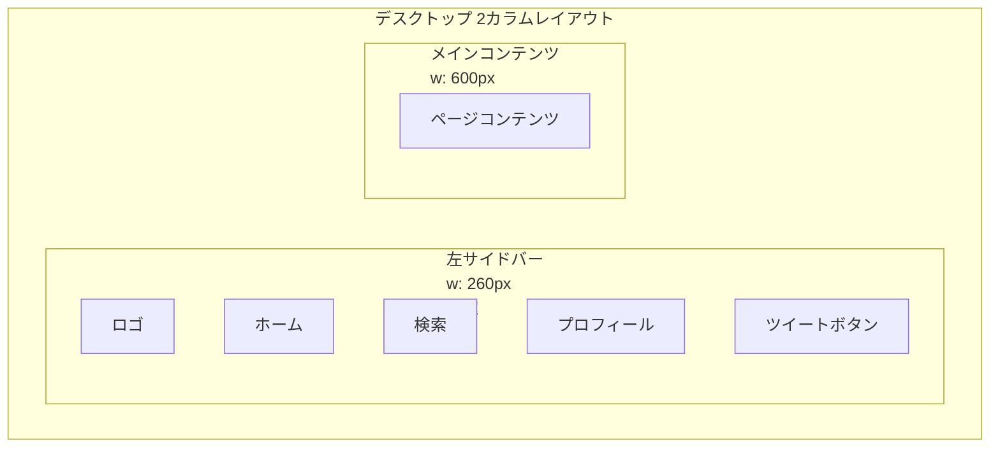
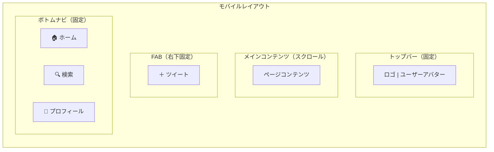
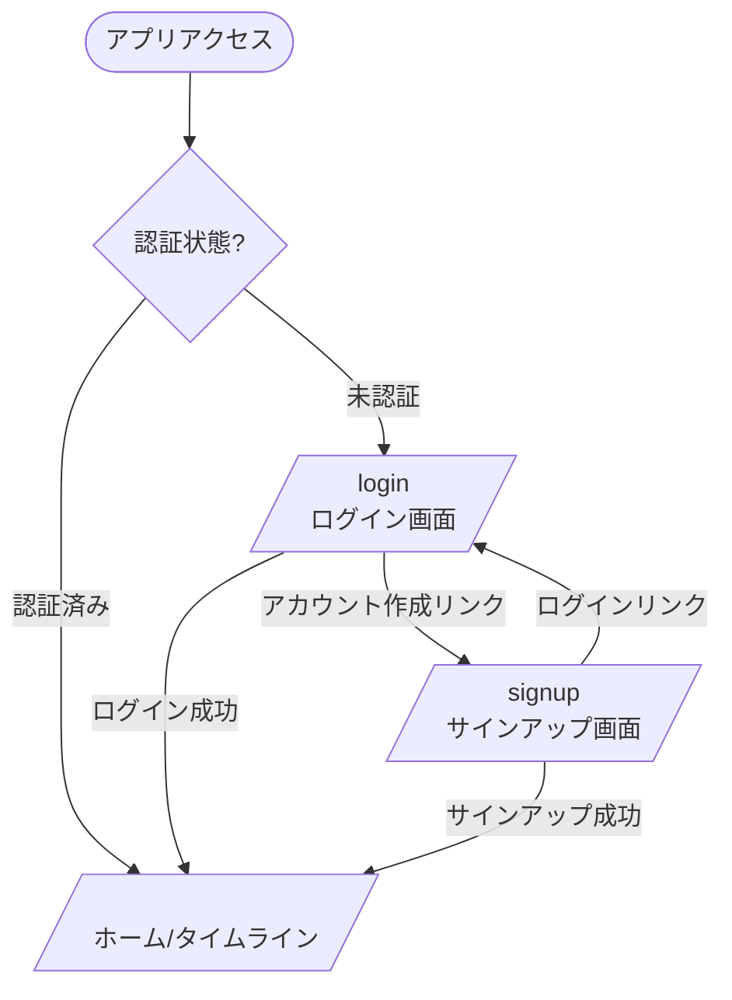
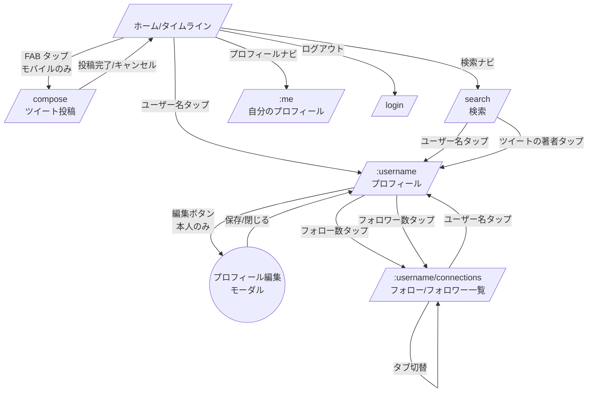

# mini-twitter 画面仕様書

## 1. ルーティング設計

### TanStack Router ファイルベースルーティング

```
src/routes/
├── __root.tsx              # ルートレイアウト（AuthGuard、レイアウト切替）
├── _auth.tsx               # 認証済みレイアウト（2カラム / モバイルレイアウト）
├── _auth/
│   ├── index.tsx           # / — ホーム/タイムライン
│   ├── compose.tsx         # /compose — ツイート投稿（モバイル専用）
│   ├── search.tsx          # /search — 検索
│   └── users/
│       ├── $username.tsx              # /:username — プロフィール（タブ: 投稿/いいね）
│       └── $username.connections.tsx  # /:username/connections — フォロー/フォロワー（タブ切替）
├── _guest.tsx              # ゲスト専用レイアウト（センター配置）
├── _guest/
│   ├── login.tsx           # /login
│   └── signup.tsx          # /signup
```

### 認証ガード戦略

| ガード | 対象ルート | 動作 |
|--------|-----------|------|
| **AuthGuard** (`_auth.tsx`) | `/`, `/compose`, `/search`, `/:username`, `/:username/connections` | 未認証 → `/login` にリダイレクト |
| **GuestGuard** (`_guest.tsx`) | `/login`, `/signup` | 認証済み → `/` にリダイレクト |

```typescript
// _auth.tsx（認証必須レイアウト）
export const Route = createFileRoute('/_auth')({
  beforeLoad: ({ context }) => {
    if (!context.auth.isAuthenticated) {
      throw redirect({ to: '/login' })
    }
  },
  component: AuthenticatedLayout,
})

// _guest.tsx（ゲスト専用レイアウト）
export const Route = createFileRoute('/_guest')({
  beforeLoad: ({ context }) => {
    if (context.auth.isAuthenticated) {
      throw redirect({ to: '/' })
    }
  },
  component: GuestLayout,
})
```

### トークンリフレッシュによるセッション復元

`__root.tsx` で初回マウント時に `refreshToken` mutation を実行する。HttpOnly Cookie の refreshToken が自動送信されるため、有効なセッションがあればセッションを復元する。復元中はスプラッシュスクリーンを表示。

---

## 2. レイアウト構成

### デスクトップレイアウト（1025px〜）

Twitter/X スタイルの2カラム構成。右サイドバーはMVPでは省略。



| カラム | 幅 | 内容 | スクロール |
|--------|-----|------|-----------|
| 左サイドバー | 260px（固定） | ナビゲーション | なし |
| メインコンテンツ | 600px（最大） | 各画面のコンテンツ | 独立スクロール |

### タブレットレイアウト（641px〜1024px）

- 左サイドバー: アイコンのみに縮小（72px）
- メインコンテンツ: 残りの幅を使用

### モバイルレイアウト（〜640px）



| 要素 | 位置 | 内容 |
|------|------|------|
| トップバー | 上部固定 | アプリロゴ + ログインユーザーアバター |
| メインコンテンツ | 中央スクロール | 各画面のコンテンツ |
| FAB | 右下固定 | タップ → `/compose` に遷移 |
| ボトムナビ | 下部固定 | ホーム / 検索 / プロフィール |

---

## 3. 各画面の仕様

### 3.1 サインアップ画面

| 項目 | 内容 |
|------|------|
| **パス** | `/signup` |
| **アクセス** | ゲストのみ（認証済み → `/` にリダイレクト） |
| **レイアウト** | センター配置カード（サイドバーなし） |

#### データ操作

- **Mutation**: `signUp(username, email, password, displayName)`
- 成功 → `AuthPayload` を受け取り、`authStore` に保存 → `/` に遷移

#### 画面構成

```
┌──────────────────────────┐
│       アプリロゴ           │
│                          │
│  ┌────────────────────┐  │
│  │ ユーザー名           │  │
│  │ [________________] │  │
│  │                    │  │
│  │ 表示名             │  │
│  │ [________________] │  │
│  │                    │  │
│  │ メールアドレス       │  │
│  │ [________________] │  │
│  │                    │  │
│  │ パスワード           │  │
│  │ [________________] │  │
│  │                    │  │
│  │ [  アカウント作成  ] │  │
│  └────────────────────┘  │
│                          │
│  ログインはこちら →       │
└──────────────────────────┘
```

#### フォームバリデーション（React Hook Form + Zod）

| フィールド | バリデーション |
|-----------|--------------|
| ユーザー名 | 必須、英数字+アンダースコア、3〜15文字 (BR-1) |
| 表示名 | 必須、最大50文字 (BR-6) |
| メールアドレス | 必須、メール形式 (BR-2) |
| パスワード | 必須、8文字以上 (BR-3) |

#### インタラクション

- 各フィールドは `onBlur` でバリデーション実行
- サーバーエラー（ユーザー名/メール重複）はフォーム上部にエラーメッセージ表示
- 送信中はボタンを `loading` 状態にし、二重送信を防止

#### モバイル/デスクトップ差分

差分なし。両方ともセンター配置のカードフォーム。

---

### 3.2 ログイン画面

| 項目 | 内容 |
|------|------|
| **パス** | `/login` |
| **アクセス** | ゲストのみ（認証済み → `/` にリダイレクト） |
| **レイアウト** | センター配置カード（サイドバーなし） |

#### データ操作

- **Mutation**: `signIn(email, password)`
- 成功 → `AuthPayload` を受け取り、`authStore` に保存 → `/` に遷移

#### 画面構成

```
┌──────────────────────────┐
│       アプリロゴ           │
│                          │
│  ┌────────────────────┐  │
│  │ メールアドレス       │  │
│  │ [________________] │  │
│  │                    │  │
│  │ パスワード           │  │
│  │ [________________] │  │
│  │                    │  │
│  │ [    ログイン     ] │  │
│  └────────────────────┘  │
│                          │
│  アカウント作成はこちら →  │
└──────────────────────────┘
```

#### フォームバリデーション

| フィールド | バリデーション |
|-----------|--------------|
| メールアドレス | 必須、メール形式 |
| パスワード | 必須、8文字以上 |

#### インタラクション

- 認証失敗時はフォーム上部に「メールアドレスまたはパスワードが正しくありません」を表示
- 送信中はボタンを `loading` 状態にする

#### モバイル/デスクトップ差分

差分なし。

---

### 3.3 ホーム/タイムライン画面

| 項目 | 内容 |
|------|------|
| **パス** | `/` |
| **アクセス** | 認証必須 |
| **レイアウト** | 2カラム（デスクトップ） / ボトムナビ+FAB（モバイル） |

#### データ操作

| 操作 | GraphQL | タイミング |
|------|---------|-----------|
| フォロータイムライン取得 | `timeline(first: 20, after?)` | 「フォロー中」タブ表示時 |
| 全体タイムライン取得 | `publicTimeline(first: 20, after?)` | 「全体」タブ表示時 |
| ツイート投稿 | `createTweet(content)` | インラインフォーム送信時（デスクトップ） |
| いいねトグル | `likeTweet(tweetUuid)` / `unlikeTweet(tweetUuid)` | いいねボタンタップ |
| ツイート削除 | `deleteTweet(uuid)` | 削除確認ダイアログで承認 |
| 新着通知 | `tweetAdded(scope)` subscription | 常時購読（タブに応じたスコープ） |

#### 画面構成

```
┌──────────────────────────────┐
│  フォロー中 │ 全体            │ ← タブ切り替え
├──────────────────────────────┤
│  ┌────────────────────────┐  │
│  │ [アバター] テキスト入力... │  │ ← インライン投稿フォーム
│  │         [300] [ツイート] │  │    （デスクトップのみ）
│  └────────────────────────┘  │
├──────────────────────────────┤
│  「N件の新しいツイート」バナー  │ ← 新着通知（Subscription）
├──────────────────────────────┤
│  ┌────────────────────────┐  │
│  │ TweetCard              │  │
│  │ TweetCard              │  │
│  │ TweetCard              │  │
│  │ ...                    │  │
│  │ [∞ 無限スクロール]      │  │
│  └────────────────────────┘  │
└──────────────────────────────┘
```

#### インタラクション

- **タブ切り替え**: 「フォロー中」（デフォルト）/ 「全体」でタイムラインを切り替え。タブ状態は `uiStore` で管理
- **無限スクロール**: `IntersectionObserver` で末尾検知 → `fetchMore` で次ページ取得
- **新着通知バナー**: `tweetAdded(scope)` subscription で新着ツイートを検知 → 「N件の新しいツイート」バナー表示 → タップでタイムライン先頭に新着を挿入。「フォロー中」タブでは `scope: FOLLOWING`、「全体」タブでは `scope: GLOBAL` で購読
- **いいね**: 楽観的更新（`likesCount` ±1、`isLikedByMe` トグル）
- **ツイート削除**: 本人のツイートのみ削除ボタン表示 → `ConfirmDialog` → `cache.evict`

#### モバイル/デスクトップ差分

| 要素 | デスクトップ | モバイル |
|------|------------|---------|
| ツイート投稿 | タイムライン上部にインラインフォーム + サイドバー「ツイート」ボタンでモーダル表示（`TweetComposerModal`） | 非表示（FAB → `/compose` に遷移） |
| 新着通知バナー | タイムライン上部に表示 | 同じ |

---

### 3.4 ツイート投稿画面（モバイル専用）

| 項目 | 内容 |
|------|------|
| **パス** | `/compose` |
| **アクセス** | 認証必須 |
| **レイアウト** | フルスクリーン（ナビ非表示） |
| **表示条件** | モバイルのみ。デスクトップでアクセスした場合は `/` にリダイレクト |

#### データ操作

- **Mutation**: `createTweet(content)`
- 成功 → `/` に遷移（`router.navigate`）

#### 画面構成

```
┌───────────────────────────────┐
│  [✕ キャンセル]   [ツイートする] │
├───────────────────────────────┤
│  ┌─────────────────────────┐  │
│  │ [アバター]               │  │
│  │                         │  │
│  │ いまどうしてる？          │  │
│  │                         │  │
│  │                         │  │
│  │                         │  │
│  └─────────────────────────┘  │
│                    残り 300文字 │
└───────────────────────────────┘
```

#### インタラクション

- テキストエリアに自動フォーカス
- 文字数カウンター: 入力に応じてリアルタイム更新。300文字超過で赤色表示、送信ボタン無効化
- 空白のみは送信不可（BR-4）
- キャンセル: `/` に戻る（入力があれば確認ダイアログ）
- 送信成功 → `/` に遷移し、Apollo キャッシュのタイムラインを更新

---

### 3.5 ユーザープロフィール画面

| 項目 | 内容 |
|------|------|
| **パス** | `/:username` |
| **アクセス** | 認証必須 |
| **レイアウト** | 2カラム（デスクトップ） / ボトムナビ（モバイル） |

#### データ操作

| 操作 | GraphQL | タイミング |
|------|---------|-----------|
| ユーザー情報取得 | `userByUsername(username)` | 画面表示時 |
| ユーザーのツイート一覧 | `userTweets(uuid, first: 20, after?)` | 「投稿」タブ表示時 |
| いいねしたツイート一覧 | `likedTweets(first: 20, after?)` | 「いいね」タブ表示時（自分のプロフィールのみ） |
| フォロー | `follow(userUuid)` | フォローボタンタップ |
| フォロー解除 | `unfollow(userUuid)` | フォロー中ボタンタップ |
| いいねトグル | `likeTweet` / `unlikeTweet` | いいねボタンタップ |
| ツイート削除 | `deleteTweet(uuid)` | 削除確認ダイアログで承認 |

#### 画面構成

```
┌──────────────────────────────────┐
│  ┌─────────┐                      │
│  │  アバター │  表示名             │
│  │  (80px)  │  @username          │
│  └─────────┘                      │
│                                  │
│  自己紹介テキスト...               │
│                                  │
│  N フォロー中  N フォロワー        │ ← タップで connections 画面へ
│                                  │
│  [ プロフィールを編集 ]            │ ← 自分の場合
│  [ フォローする / フォロー中 ]     │ ← 他人の場合
├──────────────────────────────────┤
│  投稿 │ いいね                    │ ← タブ切り替え（いいねタブは自分のみ）
├──────────────────────────────────┤
│  （投稿タブ）                     │
│  ┌────────────────────────────┐  │
│  │ TweetCard                  │  │
│  │ TweetCard                  │  │
│  │ ...                        │  │
│  │ [∞ 無限スクロール]          │  │
│  └────────────────────────────┘  │
│                                  │
│  （いいねタブ — 自分のプロフィールのみ） │
│  ┌────────────────────────────┐  │
│  │ TweetCard                  │  │
│  │ TweetCard                  │  │
│  │ ...                        │  │
│  │ [∞ 無限スクロール]          │  │
│  └────────────────────────────┘  │
└──────────────────────────────────┘
```

#### インタラクション

- **タブ切り替え**: 「投稿」（デフォルト）/ 「いいね」でコンテンツを切り替え。タブ状態は `uiStore.activeProfileTab` で管理。「いいね」タブは自分のプロフィールでのみ表示
- **自分のプロフィール**: 「プロフィールを編集」ボタン → プロフィール編集モーダルを開く
- **他人のプロフィール**: フォローボタン表示。楽観的更新で `followingCount` / `followersCount` / `isFollowedByMe` を即時反映
- **フォロー数 / フォロワー数**: タップで `/:username/connections?tab=following` or `/:username/connections?tab=followers` に遷移
- **いいねタブ**: 無限スクロールでページネーション。いいね取消後はリストから該当ツイートが消える（楽観的更新）。空状態: 「まだいいねしたツイートがありません」
- **投稿タブ**: 無限スクロール。空状態: 「まだツイートがありません」

#### モバイル/デスクトップ差分

| 要素 | デスクトップ | モバイル |
|------|------------|---------|
| アバターサイズ | 80px | 64px |
| レイアウト | 2カラム内 | フルワイド |

---

### 3.6 プロフィール編集（モーダル）

| 項目 | 内容 |
|------|------|
| **パス** | なし（モーダル。プロフィール画面上にオーバーレイ表示） |
| **アクセス** | 認証必須、本人のみ |
| **状態管理** | `uiStore.isProfileEditOpen` で開閉制御 |

#### データ操作

| 操作 | GraphQL | タイミング |
|------|---------|-----------|
| プロフィール更新 | `updateProfile(displayName?, bio?)` | 保存ボタン押下 |
| アバター更新 | `updateAvatar(avatar)` | 画像選択後に即アップロード or 保存時 |

#### 画面構成

```
┌──────────────────────────────┐
│  プロフィールを編集    [✕ 閉じる] │
├──────────────────────────────┤
│                              │
│      ┌──────────┐            │
│      │  アバター  │  [変更]   │
│      │  プレビュー │           │
│      └──────────┘            │
│                              │
│  表示名                      │
│  [_________________________] │
│                 50文字以内    │
│                              │
│  自己紹介                    │
│  [_________________________] │
│  [_________________________] │
│                200文字以内    │
│                              │
│          [  保存  ]          │
└──────────────────────────────┘
```

#### フォームバリデーション

| フィールド | バリデーション |
|-----------|--------------|
| 表示名 | 最大50文字 (BR-6) |
| 自己紹介 | 最大200文字 (BR-5) |
| アバター画像 | 最大2MB、JPEG/PNG/WebP (BR-11) |

#### インタラクション

- **アバター変更**: `input[type="file"]` で画像選択 → プレビュー表示 → 保存時に `updateAvatar` mutation
- **保存**: `updateProfile` mutation 実行。アバター変更がある場合は `updateAvatar` も実行
- **閉じる**: ✕ボタンまたはオーバーレイクリックで閉じる。未保存の変更がある場合は確認ダイアログ
- モーダルは `HeroUI` の `Modal` コンポーネントを使用

#### モバイル/デスクトップ差分

| 要素 | デスクトップ | モバイル |
|------|------------|---------|
| モーダルサイズ | 480px幅の中央モーダル | フルスクリーンに近いドロワー |

---

### 3.7 フォロー/フォロワー一覧画面

| 項目 | 内容 |
|------|------|
| **パス** | `/:username/connections?tab=followers\|following` |
| **アクセス** | 認証必須 |
| **レイアウト** | 2カラム（デスクトップ） / ボトムナビ（モバイル） |

#### データ操作

| 操作 | GraphQL | タイミング |
|------|---------|-----------|
| フォロワー一覧 | `followers(uuid, first: 20, after?)` | `tab=followers` 表示時 |
| フォロー中一覧 | `following(uuid, first: 20, after?)` | `tab=following` 表示時 |
| フォロー/フォロー解除 | `follow(userUuid)` / `unfollow(userUuid)` | フォローボタンタップ |

#### 画面構成

```
┌──────────────────────────────┐
│  [← 戻る]  @username         │
│  フォロワー │ フォロー中       │ ← タブ切り替え（クエリパラメータ）
├──────────────────────────────┤
│  ┌────────────────────────┐  │
│  │ UserCard               │  │
│  │ UserCard               │  │
│  │ ...                    │  │
│  │ [∞ 無限スクロール]      │  │
│  └────────────────────────┘  │
└──────────────────────────────┘
```

#### インタラクション

- **タブ切り替え**: 「フォロワー」「フォロー中」は同一ルートでクエリパラメータ `?tab=followers|following` で切り替え。デフォルトはプロフィール画面からの遷移元に応じて設定
- **フォローボタン**: 各 `UserCard` にフォロー/フォロー中ボタンを表示（自分自身には非表示）。楽観的更新
- **ユーザー名タップ**: プロフィール画面 (`/:username`) に遷移
- 無限スクロールでページネーション
- 空状態: 「フォロワーはいません」/「フォロー中のユーザーはいません」

---

### 3.8 検索画面

| 項目 | 内容 |
|------|------|
| **パス** | `/search` |
| **アクセス** | 認証必須 |
| **レイアウト** | 2カラム（デスクトップ） / ボトムナビ（モバイル） |

#### データ操作

| 操作 | GraphQL | タイミング |
|------|---------|-----------|
| ユーザー検索 | `searchUsers(query, first: 20, after?)` | 「ユーザー」タブで検索実行時 |
| ツイート検索 | `searchTweets(query, first: 20, after?)` | 「ツイート」タブで検索実行時 |
| フォロー/フォロー解除 | `follow` / `unfollow` | UserCard のフォローボタン |
| いいねトグル | `likeTweet` / `unlikeTweet` | TweetCard のいいねボタン |

#### 画面構成

```
┌──────────────────────────────┐
│  🔍 [検索キーワードを入力...]   │ ← 検索入力
├──────────────────────────────┤
│  ユーザー │ ツイート           │ ← タブ切り替え
├──────────────────────────────┤
│                              │
│  （ユーザータブ）             │
│  ┌────────────────────────┐  │
│  │ UserCard               │  │
│  │ UserCard               │  │
│  │ ...                    │  │
│  └────────────────────────┘  │
│                              │
│  （ツイートタブ）             │
│  ┌────────────────────────┐  │
│  │ TweetCard              │  │
│  │ TweetCard              │  │
│  │ ...                    │  │
│  └────────────────────────┘  │
│                              │
│  [∞ 無限スクロール]          │
└──────────────────────────────┘
```

#### インタラクション

- **検索入力**: デバウンス（300ms）でクエリ実行。2文字以下は `pg_trgm` の制約により検索不可 → 3文字以上で検索実行
- **タブ切り替え**: 「ユーザー」/「ツイート」タブ。タブ状態は `uiStore` で管理
- **初期状態**: 検索前は「キーワードを入力して検索」のガイドメッセージ表示
- **検索結果なし**: 「一致する結果がありません」メッセージ表示
- 無限スクロールでページネーション

#### モバイル/デスクトップ差分

| 要素 | デスクトップ | モバイル |
|------|------------|---------|
| 検索ボックス | メインエリア上部 | メインエリア上部 |

---

## 4. 共通コンポーネント一覧

### 表示系コンポーネント

| コンポーネント | 説明 | 使用画面 |
|--------------|------|---------|
| **TweetCard** | ツイート1件の表示カード。アバター、著者名（`@username`）、本文、投稿日時（相対時間）、いいねボタン+カウント、削除ボタン（本人のみ） | タイムライン、プロフィール（投稿タブ・いいねタブ）、検索 |
| **UserCard** | ユーザー1件の表示カード。アバター、表示名、`@username`、自己紹介（1行）、フォローボタン（自分以外） | フォロー/フォロワー一覧、検索結果 |
| **ProfileHeader** | プロフィール画面上部のヘッダー。アバター、表示名、`@username`、自己紹介、フォロー数/フォロワー数、編集/フォローボタン | プロフィール画面 |
| **EmptyState** | データが空のときの表示（アイコン + メッセージ） | 全一覧画面 |
| **TimeDisplay** | 相対時間（「5分前」「2時間前」）→ 24時間経過で絶対時間（「3月24日」）を表示。dayjs 使用 | TweetCard |

### 入力系コンポーネント

| コンポーネント | 説明 | 使用画面 |
|--------------|------|---------|
| **TweetComposer** | ツイート入力フォーム。テキストエリア + 文字数カウンター（`/300`）+ 送信ボタン。300文字超過で赤色警告 | タイムライン（デスクトップインライン）、投稿画面（モバイル）、TweetComposerModal |
| **TweetComposerModal** | ツイート投稿モーダル。HeroUI `Modal` + `TweetComposer` コンポーネントで構成。サイドバーの「ツイート」ボタンから開く。`uiStore.isTweetModalOpen` で開閉制御 | デスクトップのみ（サイドバー「ツイート」ボタン） |
| **SearchInput** | 検索入力欄。デバウンス付き。クリアボタン付き | 検索画面 |
| **AvatarUploader** | アバター画像アップロード。プレビュー + ファイル選択。2MB / JPEG,PNG,WebP バリデーション | プロフィール編集モーダル |

### レイアウト系コンポーネント

| コンポーネント | 説明 | 表示条件 |
|--------------|------|---------|
| **Sidebar** | デスクトップ左サイドバー。ロゴ、ナビリンク（ホーム/検索/プロフィール）、ツイートボタン、ログアウト | デスクトップ・タブレット |
| **BottomNav** | モバイルボトムナビゲーション。ホーム/検索/プロフィールの3アイテム。アクティブ状態のハイライト | モバイルのみ |
| **TopBar** | モバイルトップバー。アプリロゴ + ログインユーザーアバター | モバイルのみ |
| **FAB** | フローティングアクションボタン（`+` アイコン）。タップで `/compose` に遷移 | モバイルのみ |

### ユーティリティ系コンポーネント

| コンポーネント | 説明 | 使用画面 |
|--------------|------|---------|
| **InfiniteScrollList** | カーソルベースページネーションの汎用ラッパー。`IntersectionObserver` で末尾検知 → `fetchMore` 呼び出し。ローディングスピナー表示 | 全一覧画面 |
| **AuthGuard** | TanStack Router の `_auth` レイアウトで実装。未認証時に `/login` リダイレクト | 認証必須画面全て |
| **GuestGuard** | TanStack Router の `_guest` レイアウトで実装。認証済み時に `/` リダイレクト | ログイン、サインアップ |
| **ConfirmDialog** | 確認ダイアログ（HeroUI `Modal` ベース）。タイトル + メッセージ + キャンセル/確認ボタン | ツイート削除、未保存変更の破棄 |
| **LoadingScreen** | 全画面ローディング（スピナー + アプリロゴ）。トークンリフレッシュ中に表示 | `__root.tsx` |
| **ErrorBoundary** | エラー境界。APIエラーやレンダリングエラーをキャッチし、リトライボタン付きエラー画面を表示 | 全画面 |

---

## 5. 状態管理の責務分担

### Apollo Client（サーバー状態）

Apollo Client の正規化キャッシュにより、同一エンティティの更新が全画面に自動反映される。

| データ種別 | クエリ/ミューテーション | キャッシュ戦略 |
|-----------|---------------------|--------------|
| タイムライン | `timeline`, `publicTimeline` | `fetchMore` でマージ。新着は subscription 経由で手動挿入 |
| ユーザー情報 | `userByUsername`, `me` | `User:uuid` で正規化。`follow`/`unfollow` の戻り値で自動更新 |
| ユーザーのツイート | `userTweets` | `fetchMore` でマージ |
| いいね一覧 | `likedTweets` | `fetchMore` でマージ。`unlikeTweet` 後は `cache.evict` |
| フォロー一覧 | `followers`, `following` | `fetchMore` でマージ |
| 検索結果 | `searchUsers`, `searchTweets` | クエリごとにキャッシュ。デバウンス後に `refetch` |
| いいね操作 | `likeTweet`, `unlikeTweet` | 楽観的更新 → `Tweet:uuid` の `likesCount`, `isLikedByMe` を即時反映 |
| フォロー操作 | `follow`, `unfollow` | 楽観的更新 → `User:uuid` の `followingCount`, `followersCount`, `isFollowedByMe` を即時反映 |
| ツイート投稿 | `createTweet` | タイムラインのキャッシュに手動挿入（`cache.modify`） |
| ツイート削除 | `deleteTweet` | `cache.evict({ id: 'Tweet:uuid' })` で全画面から消去 |

### Zustand ストア（クライアント状態）

#### authStore

```typescript
interface AuthState {
  user: User | null
  accessToken: string | null
  isAuthenticated: boolean
  isInitializing: boolean  // トークンリフレッシュ中
  setAuth: (user: User, accessToken: string) => void
  clearAuth: () => void
  setInitializing: (v: boolean) => void
}
```

- `accessToken` はメモリのみ保持（永続化しない）
- `refreshToken` は HttpOnly Cookie に保持（JavaScript からアクセス不可）
- ページリロード時: `isInitializing: true` → `refreshToken` mutation（Cookie が自動送信される）→ 成功で `setAuth` / 失敗で `clearAuth`

#### uiStore

```typescript
interface UIState {
  isProfileEditOpen: boolean
  isTweetModalOpen: boolean
  activeTimelineTab: 'following' | 'global'
  activeProfileTab: 'tweets' | 'likes'
  activeSearchTab: 'users' | 'tweets'
  openProfileEdit: () => void
  closeProfileEdit: () => void
  openTweetModal: () => void
  closeTweetModal: () => void
  setTimelineTab: (tab: 'following' | 'global') => void
  setProfileTab: (tab: 'tweets' | 'likes') => void
  setSearchTab: (tab: 'users' | 'tweets') => void
}
```

### エラーハンドリング方針

- すべてのAPIエラーはGraphQL標準のトップレベルエラー形式（`{ data: null, errors: [...] }`）で返される
- フロントエンドでは `errors[0].extensions.code` に基づいてエラーの種類を判別し、適切なUI表示を行う
  - `AUTHENTICATION_ERROR`: ログイン画面にリダイレクト
  - `VALIDATION_ERROR`: フォームにインラインエラーメッセージを表示
  - その他: トースト通知またはエラー画面を表示
- MVPではUnion型エラー（Result型パターン）は採用しない

---

## 6. 画面遷移図

### ゲストフロー



### 認証済みフロー



### ナビゲーション対応表

| 遷移元 | 遷移先 | トリガー | 方法 |
|--------|--------|---------|------|
| どの画面でも | `/` | ホームナビ | Sidebar / BottomNav |
| どの画面でも | `/search` | 検索ナビ | Sidebar / BottomNav |
| どの画面でも | `/:me` | プロフィールナビ | Sidebar / BottomNav |
| `/` | `/compose` | FAB タップ | `router.navigate`（モバイルのみ） |
| `/compose` | `/` | 投稿完了/キャンセル | `router.navigate` |
| TweetCard | `/:username` | ユーザー名タップ | `Link` |
| UserCard | `/:username` | ユーザー名タップ | `Link` |
| ProfileHeader | `/:username/connections?tab=following` | フォロー数タップ | `Link` |
| ProfileHeader | `/:username/connections?tab=followers` | フォロワー数タップ | `Link` |
| `/:username` | プロフィール編集モーダル | 編集ボタン | `uiStore.openProfileEdit()` |
| Sidebar | `/login` | ログアウト | `signOut` mutation → `authStore.clearAuth()` → `router.navigate` |
